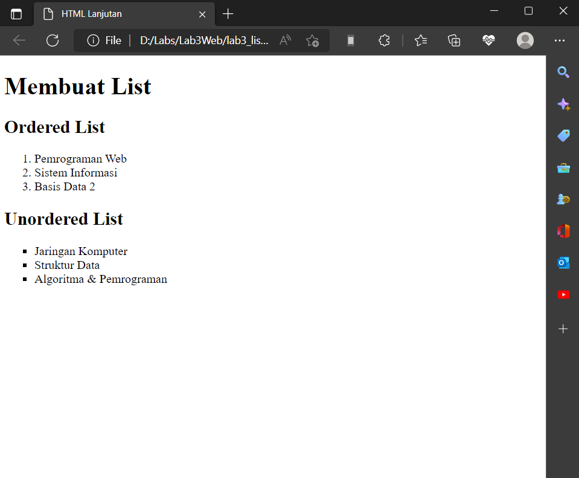

# Lab3Web
# Persiapan membuat dokumen HTML dengan nama file lab3_list.html dan Membuat Ordered List
ini adalah tampilannya

# Membuat Unorderd List
Tambahkan kode untuk membuat Unordered List, setelah deklarasi ordered list pada section unordered-list
ini adalah tampilannya

# Membuat Description List
Tambahkan kode untuk membuat description list setelah deklarasi unorderd-list
ini adalah tampilannya

# Membuat File Baru dengan nama lab3_tabel.html
Mengatur Margin dan Padding Untuk mengatur margin dan padding pada cel data, tambahkan atribut cellpadding dan cellspacing pada tag table.
`<table border="1" cellpadding="4" cellspacing="0">`
ini adalah tampilannya 

# Menggabungkan Sel Data
Untuk menggabungkan sel data, gunakan atribut rowspan dan colspan. Atribut rowspan untuk menggabungkan baris (secara vertikal) dan colspan untuk menggabungkan kolom (secara horizontal).
ini adalah tampilannya

# Membuat Form
buat file baru dengan nama lab3_form.html
ini adalah tampilannya 

# Menambahkan Style pada form
Agar tampilan form lebih menarik, bisa ditambahkan CSS seperti berikut.
``
ini adalah tampilannya 

